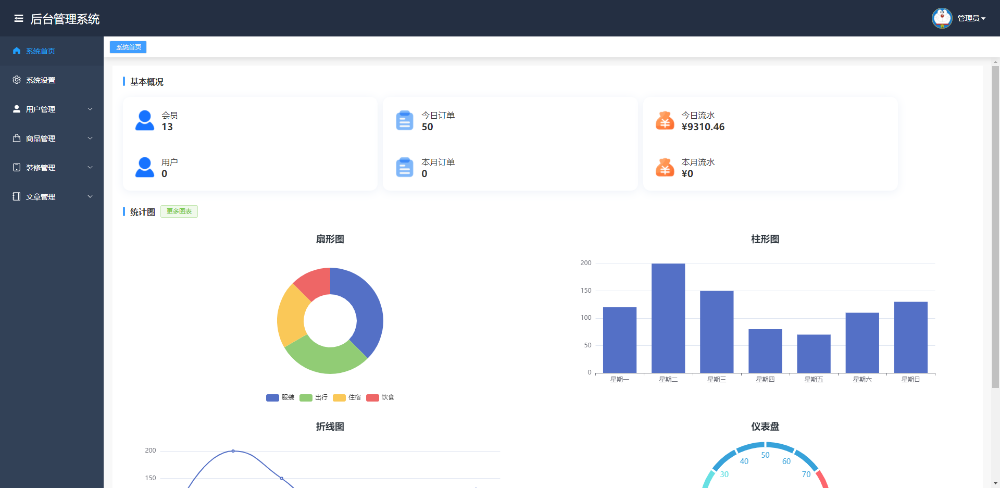
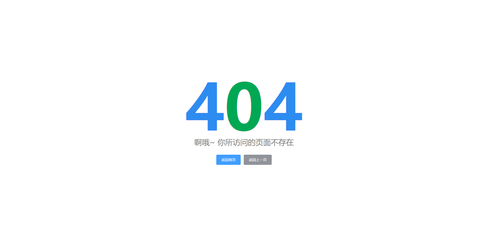
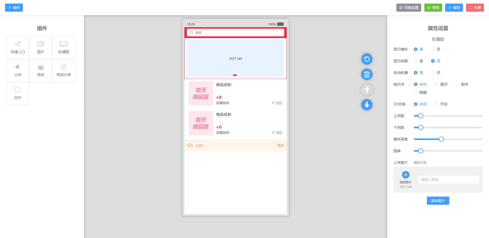

### 简介
nodejs操作数据库写接口，vue3后台，uniapp移动端，三合一，node_api接口，node_vue后台，node_uni移动端。

### 技术栈
nodejs，vue3，uniapp

### 邮箱
有问题可以提Issue，或者发邮件：249042680@qq.com，觉得不错可以点个赞

### 仓库
| gitee | github |
| --- | --- |
| [nodejs_vue3_uniapp](https://gitee.com/kangleyunju/nodejs_vue3_uniapp) | [nodejs_vue3_uniapp](https://github.com/kangleyunju/nodejs_vue3_uniapp) |

### 预览地址
[node_vue后台](https://static-mp-2503170c-6f74-4217-ac1a-43133fb6d1b4.next.bspapp.com/node_vue/)
[node_uni移动端](https://static-mp-2503170c-6f74-4217-ac1a-43133fb6d1b4.next.bspapp.com/node_uni/)

### 截图

