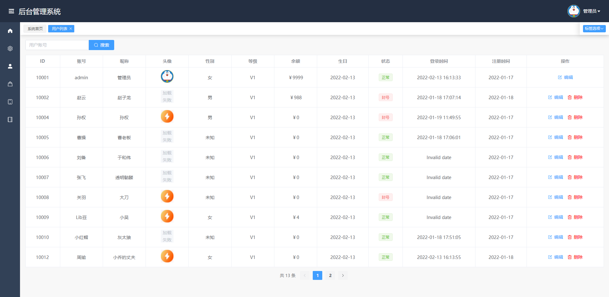

### 简介
nodejs操作数据库，vue3后台，uniapp移动端，三合一，node-api接口，node-vue后台，node-uniapp手机端

### 技术栈
nodejs，vue3，uniapp

### 邮箱
有问题可以提Issue，或者发邮件：249042680@qq.com，觉得不错可以点个赞

### 仓库
[gitee](https://gitee.com/kangleyunju/nodejs_vue3_uniapp)

[github](https://github.com/kangleyunju/nodejs_vue3_uniapp)

### 截图

